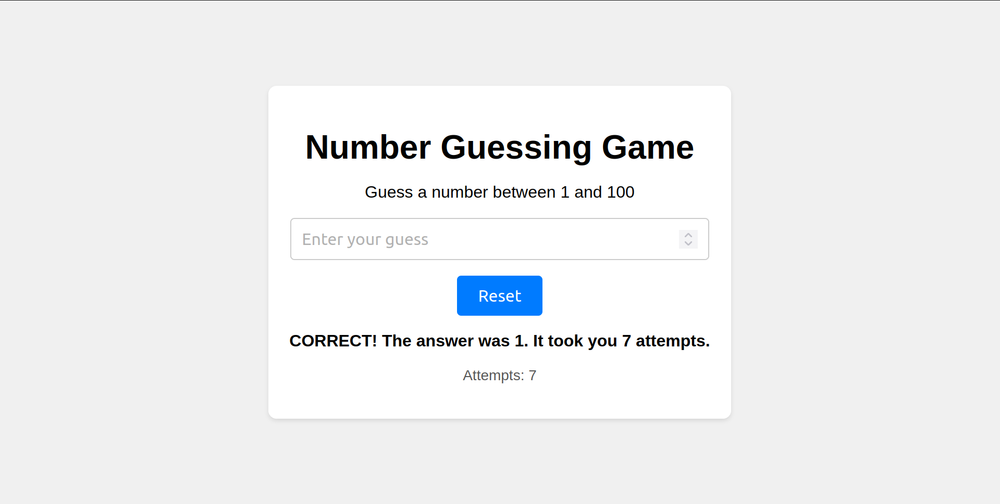

# Guessing Game

A simple number guessing game built using HTML, CSS, and JavaScript. The player needs to guess a randomly generated number within a specified range.



## Features

- Random number generation
- User input validation
- Interactive feedback
- Reset functionality

## Getting Started

### Prerequisites

To run this project, you will need:

- A modern web browser

### Installation

1. Clone the repository:
    ```bash
    git clone https://github.com/geovannwashington/guessing-game.git
    ```

2. Navigate to the project directory:
    ```bash
    cd guessing-game
    ```

3. Open `index.htm` in your web browser.

## Usage

1. Enter your guess in the input field.
2. Click the "Submit" button or press the "Enter" key.
3. Receive feedback on your guess.
4. Continue guessing until you find the correct number.
5. Use the "Reset" button to start a new game.

## License

This project is licensed under the MIT License - see the [LICENSE](LICENSE) file for details.

